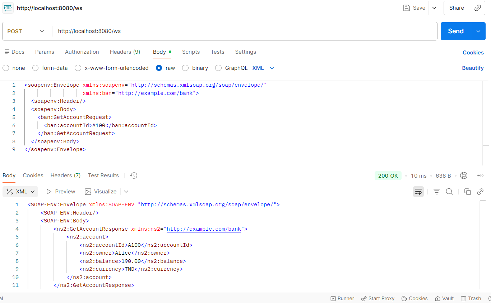
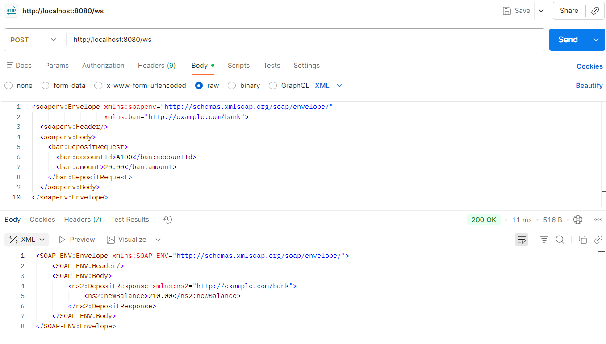
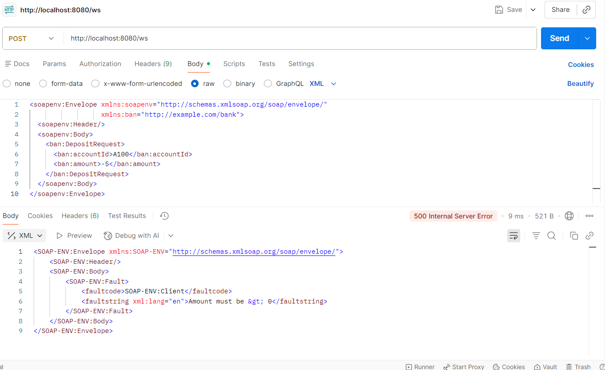
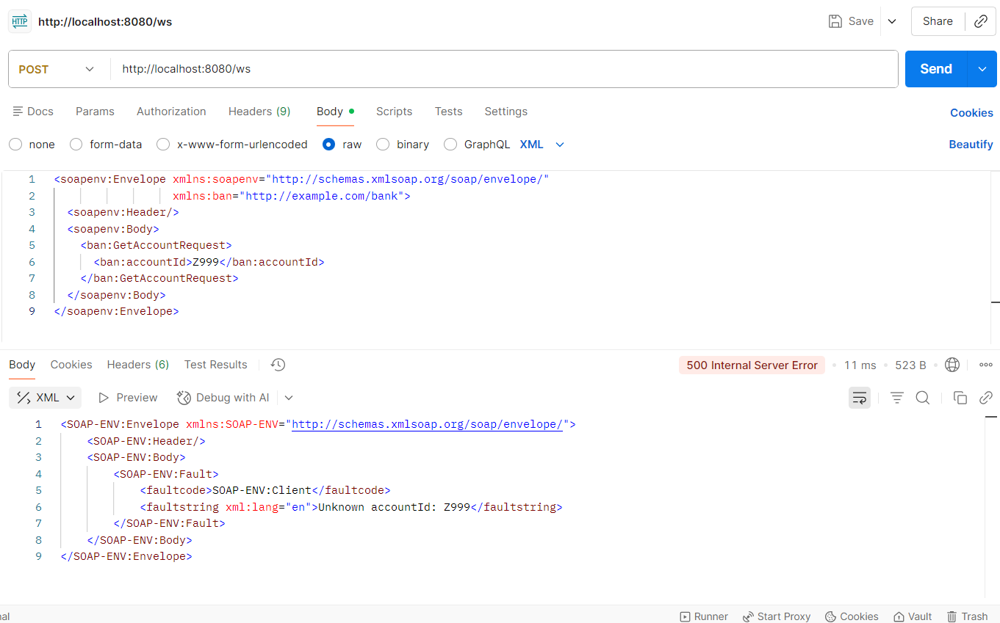

# REPONSES.md - Projet SOAP Bank

## A) Vérification du WSDL

### URL du WSDL
```
http://localhost:8080/ws/bank.wsdl
```

### Confirmation du démarrage
Le service démarre correctement avec Spring Boot sur le port 8080.

Pour démarrer le service :
```bash
mvn clean package
mvn spring-boot:run
```

Une fois démarré, l'URL du WSDL affiche un fichier XML décrivant le contrat du service SOAP.

---

## B) Lecture du contrat (Contract-First)

### 1️)Fichier XSD identifié

**Emplacement** : `src/main/resources/bank.xsd`

**Rôle du XSD** :  
Le fichier XSD définit le contrat du service SOAP. Il décrit les requêtes et réponses échangées (éléments, types, règles), à partir desquels le WSDL et les classes Java sont générés automatiquement via JAXB.

### 2️) Éléments requête / réponse

| Opération | Élément | Type | Description |
|-----------|---------|------|-------------|
| **GetAccountRequest** | accountId | string | Identifiant du compte |
| **GetAccountResponse** | account | AccountType | Objet compte complet |
| ↳ AccountType | accountId | string | Identifiant du compte |
| ↳ AccountType | owner | string | Propriétaire du compte |
| ↳ AccountType | balance | decimal | Solde du compte |
| ↳ AccountType | currency | string | Devise (ex: TND) |
| **DepositRequest** | accountId | string | Identifiant du compte |
| **DepositRequest** | amount | decimal | Montant à déposer |
| **DepositResponse** | newBalance | decimal | Nouveau solde après dépôt |

### 3️) Lecture du WSDL

**Namespace** :
```
targetNamespace="http://example.com/bank"
```

**PortType** :
```xml
<wsdl:portType name="BankPort">
```

**Opérations disponibles** :
- `GetAccount` : Récupérer les informations d'un compte
- `Deposit` : Déposer un montant sur un compte

**Endpoint** :
```
http://localhost:8080/ws
```

**Binding** : SOAP 1.1 (document/literal)

---

## 🅲 C) Tests Postman (SOAP)

### Configuration de base

**Méthode** : `POST`  
**URL** : `http://localhost:8080/ws`  
**Header** : `Content-Type: text/xml; charset=utf-8`

### 1️) Test GetAccount (A100)

**Requête XML** :
```xml
<soapenv:Envelope xmlns:soapenv="http://schemas.xmlsoap.org/soap/envelope/"
                  xmlns:ban="http://example.com/bank">
  <soapenv:Header/>
  <soapenv:Body>
    <ban:GetAccountRequest>
      <ban:accountId>A100</ban:accountId>
    </ban:GetAccountRequest>
  </soapenv:Body>
</soapenv:Envelope>
```

**Réponse** :
```xml
<SOAP-ENV:Envelope xmlns:SOAP-ENV="http://schemas.xmlsoap.org/soap/envelope/">
  <SOAP-ENV:Body>
    <ns2:GetAccountResponse xmlns:ns2="http://example.com/bank">
      <ns2:account>
        <ns2:accountId>A100</ns2:accountId>
        <ns2:owner>Alice</ns2:owner>
        <ns2:balance>150.00</ns2:balance>
        <ns2:currency>TND</ns2:currency>
      </ns2:account>
    </ns2:GetAccountResponse>
  </SOAP-ENV:Body>
</SOAP-ENV:Envelope>
```

 **Capture écran** :

### 2️) Test Deposit (20.00 sur A100)

**Requête XML** :
```xml
<soapenv:Envelope xmlns:soapenv="http://schemas.xmlsoap.org/soap/envelope/"
                  xmlns:ban="http://example.com/bank">
  <soapenv:Header/>
  <soapenv:Body>
    <ban:DepositRequest>
      <ban:accountId>A100</ban:accountId>
      <ban:amount>20.00</ban:amount>
    </ban:DepositRequest>
  </soapenv:Body>
</soapenv:Envelope>
```

**Réponse** :
```xml
<SOAP-ENV:Envelope xmlns:SOAP-ENV="http://schemas.xmlsoap.org/soap/envelope/">
  <SOAP-ENV:Body>
    <ns2:DepositResponse xmlns:ns2="http://example.com/bank">
      <ns2:newBalance>170.00</ns2:newBalance>
    </ns2:DepositResponse>
  </SOAP-ENV:Body>
</SOAP-ENV:Envelope>
```

Le solde passe de 150.00 à 170.00 TND.

 **Capture écran** : 

### 3️) Tests SOAP Fault (erreurs)

#### Test 1 : Montant négatif

**Requête XML** :
```xml
<soapenv:Envelope xmlns:soapenv="http://schemas.xmlsoap.org/soap/envelope/"
                  xmlns:ban="http://example.com/bank">
  <soapenv:Header/>
  <soapenv:Body>
    <ban:DepositRequest>
      <ban:accountId>A100</ban:accountId>
      <ban:amount>-5</ban:amount>
    </ban:DepositRequest>
  </soapenv:Body>
</soapenv:Envelope>
```

**Réponse (SOAP Fault)** :
```xml
<SOAP-ENV:Envelope xmlns:SOAP-ENV="http://schemas.xmlsoap.org/soap/envelope/">
  <SOAP-ENV:Body>
    <SOAP-ENV:Fault>
      <faultcode>SOAP-ENV:Client</faultcode>
      <faultstring xml:lang="en">Amount must be > 0</faultstring>
    </SOAP-ENV:Fault>
  </SOAP-ENV:Body>
</SOAP-ENV:Envelope>
```

 **Capture écran** :

#### Test 2 : Compte inexistant (Z999)

**Requête XML** :
```xml
<soapenv:Envelope xmlns:soapenv="http://schemas.xmlsoap.org/soap/envelope/"
                  xmlns:ban="http://example.com/bank">
  <soapenv:Header/>
  <soapenv:Body>
    <ban:GetAccountRequest>
      <ban:accountId>Z999</ban:accountId>
    </ban:GetAccountRequest>
  </soapenv:Body>
</soapenv:Envelope>
```

**Réponse (SOAP Fault)** :
```xml
<SOAP-ENV:Envelope xmlns:SOAP-ENV="http://schemas.xmlsoap.org/soap/envelope/">
  <SOAP-ENV:Body>
    <SOAP-ENV:Fault>
      <faultcode>SOAP-ENV:Client</faultcode>
      <faultstring xml:lang="en">Unknown accountId: Z999</faultstring>
    </SOAP-ENV:Fault>
  </SOAP-ENV:Body>
</SOAP-ENV:Envelope>
```

 **Capture écran** :

---

##  D) Ajout d'une fonctionnalité (Contract-First)

### Fonctionnalité ajoutée : **Withdraw** (Retrait)

**Description** : Permet de retirer un montant depuis un compte bancaire.

### Fichiers modifiés

1. `src/main/resources/bank.xsd` - Ajout des éléments WithdrawRequest et WithdrawResponse
2. `src/main/java/com/example/bank/endpoint/BankEndpoint.java` - Ajout de la méthode withdraw()
3. `src/main/java/com/example/bank/service/BankService.java` - Ajout de la logique métier withdraw()
4. `src/main/java/com/example/bank/service/InsufficientBalanceException.java` - Nouvelle exception (à créer)
5. Classes générées automatiquement : `WithdrawRequest.java` et `WithdrawResponse.java`

### Modifications détaillées

#### 1. Modification du XSD (`bank.xsd`)

Ajouter avant la balise `</xsd:schema>` :

```xml
<xsd:element name="WithdrawRequest">
  <xsd:complexType>
    <xsd:sequence>
      <xsd:element name="accountId" type="xsd:string"/>
      <xsd:element name="amount" type="xsd:decimal"/>
    </xsd:sequence>
  </xsd:complexType>
</xsd:element>

<xsd:element name="WithdrawResponse">
  <xsd:complexType>
    <xsd:sequence>
      <xsd:element name="newBalance" type="xsd:decimal"/>
    </xsd:sequence>
  </xsd:complexType>
</xsd:element>
```

#### 2. Nouvelle exception (`InsufficientBalanceException.java`)

```java
package com.example.bank.service;

import org.springframework.ws.soap.server.endpoint.annotation.FaultCode;
import org.springframework.ws.soap.server.endpoint.annotation.SoapFault;

@SoapFault(faultCode = FaultCode.CLIENT)
public class InsufficientBalanceException extends RuntimeException {
  public InsufficientBalanceException(String message) {
    super(message);
  }
}
```

#### 3. Ajout dans BankService.java

```java
public BigDecimal withdraw(String accountId, BigDecimal amount) {
  if (amount == null || amount.compareTo(BigDecimal.ZERO) <= 0) {
    throw new InvalidAmountException("Amount must be > 0");
  }
  Account acc = db.get(accountId);
  if (acc == null) {
    throw new UnknownAccountException("Unknown accountId: " + accountId);
  }
  if (acc.balance.compareTo(amount) < 0) {
    throw new InsufficientBalanceException("Insufficient balance. Current: " + acc.balance);
  }
  acc.balance = acc.balance.subtract(amount);
  return acc.balance;
}
```

#### 4. Ajout dans BankEndpoint.java

```java
@PayloadRoot(namespace = NAMESPACE_URI, localPart = "WithdrawRequest")
@ResponsePayload
public WithdrawResponse withdraw(@RequestPayload WithdrawRequest request) {
  BigDecimal newBalance = bankService.withdraw(request.getAccountId(), request.getAmount());
  WithdrawResponse resp = new WithdrawResponse();
  resp.setNewBalance(newBalance);
  return resp;
}
```

### Tests Postman pour Withdraw

#### Test nominal : Retrait valide (50.00 sur A100)

**Requête XML** :
```xml
<soapenv:Envelope xmlns:soapenv="http://schemas.xmlsoap.org/soap/envelope/"
                  xmlns:ban="http://example.com/bank">
  <soapenv:Header/>
  <soapenv:Body>
    <ban:WithdrawRequest>
      <ban:accountId>A100</ban:accountId>
      <ban:amount>50.00</ban:amount>
    </ban:WithdrawRequest>
  </soapenv:Body>
</soapenv:Envelope>
```

**Réponse** :
```xml
<SOAP-ENV:Envelope xmlns:SOAP-ENV="http://schemas.xmlsoap.org/soap/envelope/">
  <SOAP-ENV:Body>
    <ns2:WithdrawResponse xmlns:ns2="http://example.com/bank">
      <ns2:newBalance>100.00</ns2:newBalance>
    </ns2:WithdrawResponse>
  </SOAP-ENV:Body>
</SOAP-ENV:Envelope>
```


#### Test erreur : Solde insuffisant (retrait de 200.00 sur A100)

**Requête XML** :
```xml
<soapenv:Envelope xmlns:soapenv="http://schemas.xmlsoap.org/soap/envelope/"
                  xmlns:ban="http://example.com/bank">
  <soapenv:Header/>
  <soapenv:Body>
    <ban:WithdrawRequest>
      <ban:accountId>A100</ban:accountId>
      <ban:amount>200.00</ban:amount>
    </ban:WithdrawRequest>
  </soapenv:Body>
</soapenv:Envelope>
```

**Réponse (SOAP Fault)** :
```xml
<SOAP-ENV:Envelope xmlns:SOAP-ENV="http://schemas.xmlsoap.org/soap/envelope/">
  <SOAP-ENV:Body>
    <SOAP-ENV:Fault>
      <faultcode>SOAP-ENV:Client</faultcode>
      <faultstring xml:lang="en">Insufficient balance. Current: 150.00</faultstring>
    </SOAP-ENV:Fault>
  </SOAP-ENV:Body>
</SOAP-ENV:Envelope>
```


---

##  Livrables finaux

- ✔ Code pushé sur le fork Git
- ✔ Captures d'écran Postman (GetAccount, Deposit, Withdraw, SOAP Faults)
- ✔ REPONSES.md complété
- ✔ Commits propres avec messages clairs

---

##  Notes complémentaires

### Compilation et génération des classes

Après modification du XSD, exécuter :
```bash
mvn clean compile
```

Les classes Java sont générées dans : `target/generated-sources/jaxb/com/example/bank/ws/`

### Comptes de test disponibles

- **A100** : Alice, 150.00 TND
- **B200** : Bob, 80.50 TND
